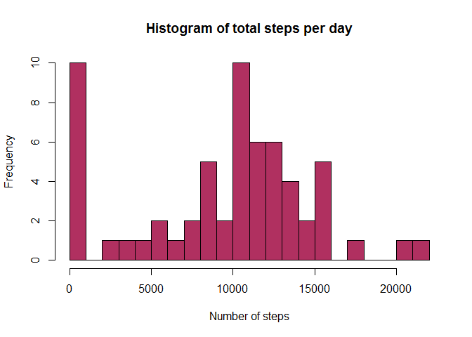
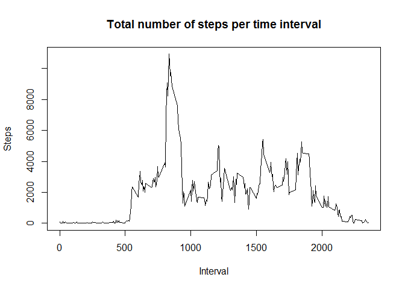
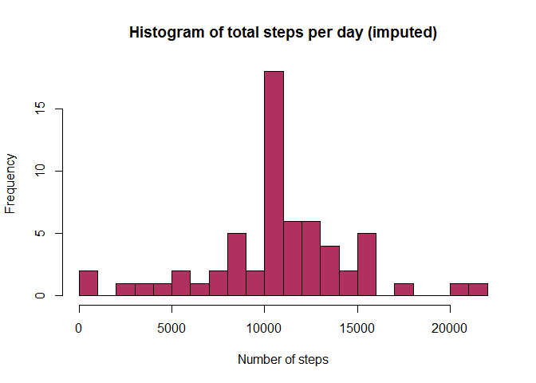
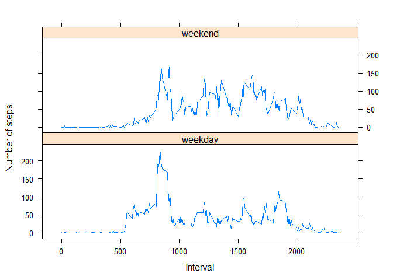

# Reproducible Research: Peer Assessment 1
Daryush Nadim  
22 April 2016  


## Loading and preprocessing the data

Load data from "activity.csv" and convert the date variable into Date format, so it can be treated as a "proper" date:


```r
activity <- read.csv("activity.csv", stringsAsFactors = FALSE)
activity$date <- as.Date(activity$date)
```

## What is the mean total number of steps taken per day?

Total number of steps taken per day (ignoring NAs):


```r
totalstepsperday <- aggregate(steps ~ date, data = activity, sum, na.rm=TRUE, na.action=NULL)
```

Histogram of the total number of steps taken per day:


```r
hist(totalstepsperday$steps, breaks = 20, xlab = "Number of steps", main = "Histogram of total steps per day", col = "maroon")
```



Mean of the total number of steps taken per day:


```r
mean(totalstepsperday$steps, na.rm = TRUE)
```

```
## [1] 9354.23
```

Median of the total number of steps taken per day:


```r
median(totalstepsperday$steps, na.rm = TRUE)
```

```
## [1] 10395
```

## What is the average daily activity pattern?

Total number of steps taken per 5-minute time interval (ignoring NAs):


```r
totalstepspertime <- aggregate(steps ~ interval, data = activity, sum, na.rm=TRUE, na.action=NULL)
```

Time series plot of the 5-minute interval and the average number of steps taken, averaged across all days:


```r
plot(totalstepspertime, type = "l", xlab = "Interval", ylab = "Steps", main = "Total number of steps per time interval")
```



5-minute interval, on average across all the days in the dataset, containing the maximum number of steps:


```r
totalstepspertime[which.max(totalstepspertime$steps), 1]
```

```
## [1] 835
```

## Imputing missing values

Total number of missing values in the dataset (i.e. the total number of rows with NAs):


```r
sum(is.na(activity[,1]))
```

```
## [1] 2304
```

Fill missing NAs with the average number of steps taken for the same 5-minute interval over the days where the same 5-minute interval contained non-NA number of steps, i.e. don't take into account days where the steps were NA.

Subset only observations where the number of steps was not NA:


```r
activity_no_NAs <- subset(activity, !is.na(activity$steps))
```

Calculate the mean number of steps per 5-minute interval and round the result up:
        

```r
meanstepsperint <- aggregate(steps ~ interval, data = activity_no_NAs, mean)
meanstepsperint[,2] <- round(meanstepsperint[,2])
```

Get vector of missing steps values:


```r
act_NAs <- is.na(activity$steps)
```

Create a new dataset that is equal to the original dataset. Add "_imp" to the name to indicate imputed data set:


```r
activity_imp <- activity
```

Fill the missing steps values for an interval with the mean number of steps for that interval (i.e. imputed values):


```r
activity_imp[act_NAs, 1] <- meanstepsperint[match(activity_imp[act_NAs, 3], meanstepsperint$interval), 2]
```

Total number of steps taken per day (imputed data set):


```r
totalstepsperday <- aggregate(steps ~ date, data = activity_imp, sum, na.rm=TRUE, na.action=NULL)
```

Histogram of the total number of steps taken per day (imputed data set). 


```r
hist(totalstepsperday$steps, breaks = 20, xlab = "Number of steps", main = "Histogram of total steps per day (imputed)", col = "maroon")
```



***Imputed values shift the histogram to the right hence increasing the mean and the median of the total number of steps taken per day as the majority of the imputed values are greater than 0, whereas in the original data set their value was treated as 0.***

Mean of the total number of steps taken per day (imputed data set):


```r
mean(totalstepsperday$steps, na.rm = TRUE)
```

```
## [1] 10765.64
```

Median of the total number of steps taken per day (imputed data set):


```r
median(totalstepsperday$steps, na.rm = TRUE)
```

```
## [1] 10762
```

## Are there differences in activity patterns between weekdays and weekends?

Create new factor variable in the dataset with two levels - "weekday" and "weekend" indicating whether a given date is a weekday or weekend day:


```r
activity_imp$daytype <- as.factor(ifelse(weekdays(activity_imp$date)=="Saturday" | weekdays(activity_imp$date)=="Sunday", "weekend", "weekday"))
```

Calculate the mean number of steps per 5-minute time interval and day type and round the result up:


```r
meanstepsperinterval <- aggregate(steps ~ interval + daytype, data = activity_imp, mean)
meanstepsperinterval[,3] <- round(meanstepsperinterval[,3])
```

Panel plot of the 5-minute time interval and the average number of steps taken, averaged across all weekday days or weekend days:


```r
library(lattice)
print(xyplot(steps~interval | daytype, data=meanstepsperinterval, main="", xlab="Interval",  ylab="Number of steps",layout=c(1,2),type=c("l","l")))
```



***A weekend has a more even distribution of steps throughout the day compared to a weekday.***

        
        
